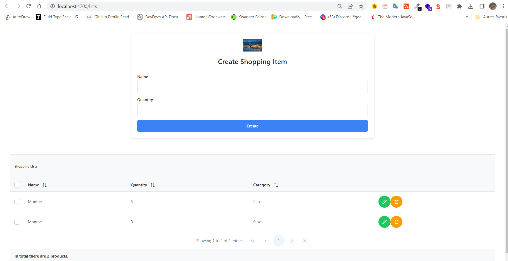
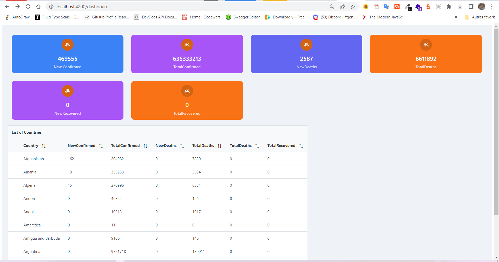
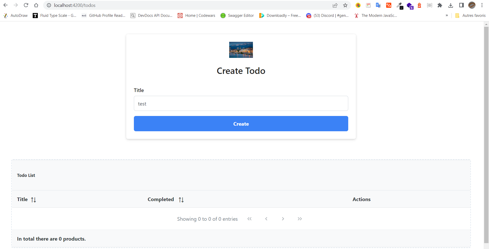

# ShoppingListApp

This project was generated with [Angular CLI](https://github.com/angular/angular-cli) version 14.2.6.
I build a CRUD shop app with angular framework and PrimeNG Ui library. This app is connected to an Express-Typescript API server
to make requests and I stored all shopping items in the MongoDB Database.

this link [Shopping App](https://sweet-kulfi-1dcd5b.netlify.app/lists) displays all resources for shopping.
the result will be like this : 

# Covid19 App

This project was generated with [Angular CLI](https://github.com/angular/angular-cli) version 14.2.6.
I build a Covid19 application with angular framework and PrimeNG Ui library. This application consumes API like
[https://api.covid19api.com/summary](https://api.covid19api.com/summary) to get all important informations about 
Covid19

this link [Covid19 App](https://sweet-kulfi-1dcd5b.netlify.app/dashboard) displays all resources for Covid19.
the result will be like this : 

# TodoList App

This project was generated with [Angular CLI](https://github.com/angular/angular-cli) version 14.2.6.
I build a CRUD TodoList app with angular framework and PrimeNG Ui library. This app is connected to an Express-Typescript API server
to make requests and I stored all shopping items in the MongoDB Database.

this link [Todos List App](https://sweet-kulfi-1dcd5b.netlify.app/todos) displays all resources for todos and display a form to register a new todo.

the result will be like this : 

## Development server

Run `ng serve` for a dev server. Navigate to `http://localhost:4200/`. The application will automatically reload if you change any of the source files.

## Code scaffolding

Run `ng generate component component-name` to generate a new component. You can also use `ng generate directive|pipe|service|class|guard|interface|enum|module`.

## Build

Run `ng build` to build the project. The build artifacts will be stored in the `dist/` directory.

## Running unit tests

Run `ng test` to execute the unit tests via [Karma](https://karma-runner.github.io).

## Running end-to-end tests

Run `ng e2e` to execute the end-to-end tests via a platform of your choice. To use this command, you need to first add a package that implements end-to-end testing capabilities.

## Further help

To get more help on the Angular CLI use `ng help` or go check out the [Angular CLI Overview and Command Reference](https://angular.io/cli) page.
